# Лабораторная работа №3. Облачные сети

## Цели работы

Научиться вручную создавать виртуальную сеть (VPC) в AWS, добавлять в неё подсети, таблицы маршрутов, интернет-шлюз (IGW) и NAT Gateway, а также настраивать взаимодействие между веб-сервером в публичной подсети и сервером базы данных в приватной.

После выполнения работы я научилась:

- понимать, как формируется изоляция сетей в AWS (VPC);
- создавать и связывать компоненты сети;
- как EC2-инстансы разных подсетей взаимодействуют друг с другом;
- различать публичные и приватные маршруты.

## Условия

_Amazon VPC (Virtual Private Cloud)_ — это собственная виртуальная сеть в облаке AWS.
Она полностью изолирована от других пользователей и позволяет управлять адресным пространством, подсетями, шлюзами и безопасностью.

В типичном сценарии у нас есть:

- _Публичная подсеть_. Для веб-сервера (имеет выход в интернет).
- _Приватная подсеть_. Для базы данных (без прямого доступа извне).
- _NAT Gateway_. Чтобы приватные ресурсы имели доступ в интернет (например, для обновления ПО).
- _Route Tables_. Определяют, куда направлять трафик.
- _Security Groups_. Управляют входящими и исходящими соединениями на уровне инстансов.
- _EC2-инстансы_. Веб-сервер, сервер базы данных и bastion host.

### Шаг 1. Подготовка среды

Для этого реализованы следующие шаги:

1. Вошла в AWS Management Console.
2. Убедилась, что регион установлен на `Frankfurt` (eu-central-1).
3. В строке поиска ввела _VPC_ и откройте консоль.

### Шаг 2. Создание VPC

1. В левой панели выбрала `Your VPCs` → `Create VPC`.
2. Указала:
   1. `Name tag`: `student-vpc-k11`.
   2. `IPv4 CIDR block`: `10.11.0.0/16`
   3. `Tenancy`: Default
3. Нажала `Create VPC`.


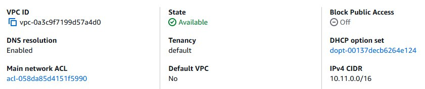

>Что обозначает маска `/16`? И почему нельзя использовать, например, `/8`?

Маска /16 определяет, какая часть адреса относится к сети, а какая — к хостам.
/16 означает, что первые 16 бит адреса — это адрес сети, а оставшиеся 16 бит используются для адресов внутри этой сети. Если выбрать маску /8, например 10.0.0.0/8, то сеть будет иметь 16 миллионов адресов и это слишком большой диапазон.

_VPC_ — это “контейнер” для подсетей. Внутри одной VPC можно создавать десятки подсетей с разными маршрутами и правилами.

### Шаг 3. Создание Internet Gateway (IGW)

Internet Gateway позволяет ресурсам внутри VPC выходить в Интернет. _Без него публичные IP-адреса не будут работать_. Если вашей виртуальной машине (EC2) назначен публичный IP, но нет IGW, она не сможет общаться с внешним миром.

1. В левой панели выбираю `Internet Gateways` → `Create internet gateway`.
2. Указываю имя: `student-igw-k11`.
3. Теперь нужно “прикрепить” (Attach) шлюз к моей сети:
   1. Выбираю созданный IGW.
   2. Нажимаю `Actions` → `Attach to VPC`.
   3. В списке выбираю `student-vpc-k11`.
   4. Подтверждаю действие.

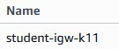
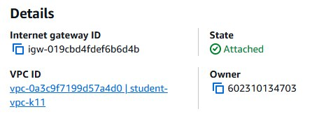

### Шаг 4. Создание подсетей

_Подсети (subnets)_ — это сегменты внутри VPC, которые позволяют изолировать ресурсы. То есть, подсети создаются для разделения ресурсов по функционалу и уровню доступа и для более гибкого управления трафиком.

#### Шаг 4.1. Создание публичной подсети

Теперь, когда есть VPC и Internet Gateway, создаю первую подсеть — публичную.
Эта подсеть будет содержать ресурсы, которым нужен прямой доступ из Интернета.

1. В левой панели выбираю `Subnets` → `Create subnet`.
2. Указываю:
   1. `VPC ID`: выбираю мою сеть `student-vpc-k11`
   2. `Subnet name`: `public-subnet-k11`
   3. `Availability Zone`: `eu-central-1a`
   4. `IPv4 CIDR block`: `10.11.1.0/24`
3. Нажимаю `Create subnet`.

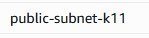
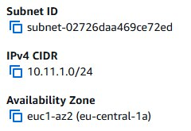

> Является ли подсеть "публичной" на данный момент? Почему?

На данный момент подсеть не является публичной, так как у неё нет маршрута на 0.0.0.0/0 через Internet Gateway. Чтобы подсеть стала публичной, нужно привязать маршрутную таблицу, содержащую маршрут в IGW.

#### Шаг 4.2. Создание приватной подсети

Подсеть называется приватной, если её трафик не направляется напрямую в Интернет.

1. Нажимаю `Create subnet`.
2. Указываю:
   1. `VPC ID`: выбираю мою сеть `student-vpc-k11`
   2. `Subnet name`: `private-subnet-k11`
   3. `Availability Zone`: `eu-central-1b`
   4. `IPv4 CIDR block`: `10.(k%30).2.0/24`
3. Нажмите `Create subnet`.

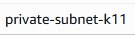
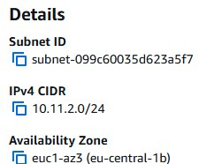

> Является ли подсеть "приватной" на данный момент? Почему?

Пока подсеть не является приватной. Она просто новая подсеть без маршрутов. Приватной она станет тогда, когда мы настроим выход в Интернет через NAT для исходящего трафика.

### Шаг 5. Создание таблиц маршрутов (Route Tables)

Теперь, когда есть две подсети (публичная и приватная), необходимо настроить маршруты (Route Tables), которые определяют, как сетевой трафик будет двигаться внутри моей VPC.

По умолчанию каждая новая VPC имеет одну основную таблицу маршрутов, и все новые подсети автоматически к ней подключаются. Если зайти в `Route Tables`, можно увидеть одну таблицу, связанную с моей VPC.

Но для лучшей структуры и изоляции я создаю:

- отдельную таблицу маршрутов для публичной подсети (с доступом к Интернету через IGW),
- отдельную таблицу маршрутов для приватной подсети (с доступом к Интернету через NAT Gateway).

#### Шаг 5.1. Создание публичной таблицы маршрутов

1. В левой панели выбираю `Route Tables` → `Create route table`.
2. Указываю:
   1. `Name tag`: `public-rt-k11`
   2. `VPC`: `student-vpc-k11`
   3. Нажимаю `Create route table`
   4. Перехожу на вкладку `Routes` и нажимаю `Edit routes` → `Add route`.
   5. Заполняю:
      1. `Destination`: 0.0.0.0/0
      2. `Target`: выбираю Internet Gateway (`student-igw-k11`).
   6. Нажимаю `Save changes`.
   7. Перехожу на вкладку `Subnet associations` → `Edit subnet associations`.
> Зачем необходимо привязать таблицу маршрутов к подсети?

Таблицу маршрутов нужно привязать к подсети, чтобы именно эта подсеть начала использовать указанные маршруты. Без ассоциации подсеть будет применять основную таблицу маршрутов, и созданный маршрут в Internet Gateway не будет работать.

   8. Отмечаю `public-subnet-k11` и нажимаю `Save associations`.

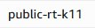
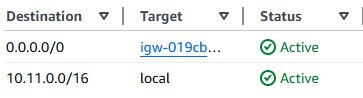

Теперь трафик из публичной подсети (например, от веб-сервера или NAT Gateway) будет отправляться наружу через Internet Gateway. Связь `“0.0.0.0/0 → IGW”` — именно то, что делает подсеть публичной.

#### Шаг 5.2. Создание приватной таблицы маршрутов

1. Нажимаю `Create route table`.
2. Указываю:
   1. `Name tag`: `private-rt-k11`
   2. `VPC`: `student-vpc-k11`
   3. Нажимаю `Create route table`.
3. Перехожу на вкладку `Subnet associations` → `Edit subnet associations`.
4. Отмечаю `private-subnet-k11` и нажимаю `Save associations`.

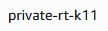
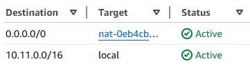

На данный момент все ресурсы, которые будут созданы в приватной подсети, не смогут выходить в Интернет, так как у меня нет NAT Gateway и соответствующего маршрута.

### Шаг 6. Создание NAT Gateway

NAT Gateway позволяет ресурсам в приватной подсети выходить в Интернет (например, для обновления ПО), при этом оставаясь недоступными извне.

> Как работает NAT Gateway?

NAT Gateway позволяет серверам в приватных подсетях выходить в Интернет, не раскрывая их приватные IP-адреса.

#### Шаг 6.1. Создание Elastic IP

_Elastic IP_ — это статический публичный IPv4-адрес, закреплённый за моим аккаунтом AWS.
Он используется для NAT Gateway, чтобы тот мог представлять собой “точку выхода” в Интернет от имени всех приватных инстансов.

1. В левой панели выбираю `Elastic IPs` → `Allocate Elastic IP address`.
2. Нажимаю Allocate.

#### Шаг 6.2. Создание NAT Gateway

1. В левой панели выбираю `NAT Gateways` → `Create NAT gateway`.
2. Указываю:
   1. `Name tag`: `nat-gateway-k11`
   2. `Subnet`: выбираю публичную подсеть (`public-subnet-k11`)
> NAT Gateway всегда создаётся в публичной подсети, потому что ему нужен прямой выход в Интернет через IGW.
   3. `Connectivity type`: `Public`
   4. `Elastic IP allocation ID`: выбираю EIP, созданный на предыдущем шаге.
3. Нажимаю `Create NAT gateway`.

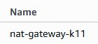
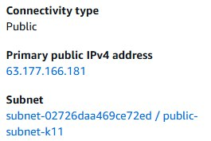

Жду 2–3 минуты, пока статус изменится с `Pending` на `Available`. Это значит, что NAT Gateway готов к работе.

#### Шаг 6.3. Изменение приватной таблицы маршрутов

1. Возвращаюсь в `Route Tables` и выбираю `private-rt-k11`.
2. Перехожу на вкладку `Routes` и нажимаю `Edit routes` → `Add route`.
3. Заполняю:
   1. `Destination`: `0.0.0.0/0`
   2. `Target`: выбираю NAT Gateway (`nat-gateway-kXX`).
4. Нажмимаю `Save changes`.

Теперь ресурсы в приватной подсети смогут выходить в Интернет через NAT Gateway.

### Шаг 7. Создание Security Groups

_Security Group (SG)_ — это виртуальный брандмауэр на уровне инстанса (EC2), который контролирует входящий (Inbound) и исходящий (Outbound) трафик.

1. В левой панели выбираю `Security Groups` → `Create security group`.
2. Указываю:
   1. `Security group name`: `web-sg-k11`
   2. `Description`: `Security group for web server`
   3. `VPC`: выбираю мою VPC (`student-vpc-k11`)
3. В разделе Inbound rules добавляю правила разрешающее следующие типы трафика:
   1. Тип: `HTTP`, Протокол: `TCP`, Порт: `80`, Источник: `0.0.0.0/0`
   2. Тип: `HTTPS`, Протокол: `TCP`, Порт: `443`, Источник: `0.0.0.0/0`

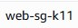
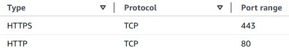

4. Создаю еще две Security Groups:
   1. `bastion-sg-k11` для bastion host с разрешением входящего трафика на порт `22` (SSH) только из моего IP-адреса.

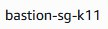
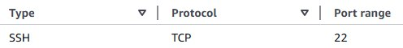

   3. `db-sg-k11` для базы данных с разрешением входящего трафика:
      1. Тип: `MySQL/Aurora`, Протокол: `TCP`, Порт: `3306`, Источник: `web-sg-k11` (разрешаю доступ только с веб-сервера)
      2. Тип: `MySQL/Aurora`, Протокол: `TCP`, Порт: `3306`, Источник: `bastion-sg-k11` (разрешаю доступ только с bastion host)
      3. Тип: `SSH`, Протокол: `TCP`, Порт: `22`, Источник: `bastion-sg-k11` (разрешаю доступ только с bastion host)

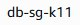
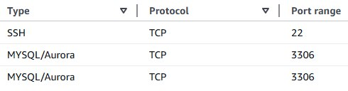

> Что такое _Bastion Host_ и зачем он нужен в архитектуре с приватными подсетями?

Bastion Host — это сервер в публичной подсети, через который администратор получает доступ к ресурсам в приватных подсетях. Он обеспечивает безопасный SSH-доступ, не раскрывая приватные сервера в Интернет.

### Шаг 8. Создание EC2-инстансов

Создаю три EC2-инстанса, которые будут выполнять следующие роли:

- _Веб-сервер_ (`web-server`) - в публичной подсети, доступен из Интернета по HTTP.
- _Сервер базы данных_ (`db-server`) - в приватной подсети, недоступен напрямую извне.
- _Bastion Host_ (`bastion-host`) - в публичной подсети, для безопасного доступа к приватным ресурсам.

1. В строке поиска AWS Console ввожу `EC2` и открываю консоль.
2. Создаю 3 инстанса, следуя инструкциям ниже.

_Для всех инстансов использую_:

- AMI: `Amazon Linux 2 AMI (HVM), SSD Volume Type`
- Тип инстанса: `t3.micro`
- Ключ доступа (Key Pair): создаю новый ключ `student-key-k11` и скачиваю его.
- Хранилище: оставляю по умолчанию (8 ГБ).
- Теги: добавляю тег `Name` с соответствующим именем инстанса.

Для `web-server`:

1. Выбираю сеть `VPC`: `student-vpc-k11`
2. Подсеть `Subnet`: `public-subnet-k11`
3. `Auto-assign Public IP`: `Enable`
4. `Security Group`: выбираю `web-sg-k11`
5. В разделе `Advanced Details` в поле `User data` вставляю следующий скрипт для автоматической установки веб-сервера:

   ```bash
   #!/bin/bash
   dnf install -y httpd php
   echo "<?php phpinfo(); ?>" > /var/www/html/index.php
   systemctl enable httpd
   systemctl start httpd
   ```

Для `db-server`:

1. Выбираю сеть `VPC`: `student-vpc-k11`
2. Подсеть `Subnet`: `private-subnet-k11`
3. `Auto-assign Public IP`: `Disable`
4. `Security Group`: выбираю `db-sg-k11`
5. В разделе `Advanced Details` в поле `User data` вставляю следующий скрипт для автоматической установки MySQL сервера:

   ```bash
   #!/bin/bash
   dnf install -y mariadb105-server
   systemctl enable mariadb
   systemctl start mariadb
   mysql -e "ALTER USER 'root'@'localhost' IDENTIFIED BY 'StrongPassword123!'; FLUSH PRIVILEGES;"
   ```

Для `bastion-host`:

1. Выбираю сеть `VPC`: `student-vpc-k11`
2. Подсеть `Subnet`: `public-subnet-k11`
3. `Auto-assign Public IP`: `Enable`
4. `Security Group`: выбираю `bastion-sg-k11`
5. В разделе `Advanced Details` в поле `User data` вставляю следующий скрипт для автоматической установки MySQL клиента:

   ```bash
   #!/bin/bash
   dnf install -y mariadb105
   ```
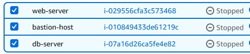
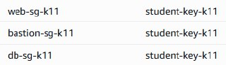

### Шаг 9. Проверка работы

На этом этапе я уже создала:

- виртуальную сеть (VPC)
- публичную и приватную подсети
- интернет-шлюз (IGW)
- NAT Gateway
- две таблицы маршрутов
- три экземпляра EC2 (Web, DB и Bastion)
- три Security Group

Теперь важно убедиться, что сеть функционирует корректно и что приватная подсеть действительно изолирована от внешнего мира.

1. Жду, пока все инстансы запустятся (статус `running`).
2. Нахожу публичный IP-адрес `web-server` и открываю его в браузере. Я должна увидеть страницу с информацией о PHP.
3. Подключаюсь к `bastion-host` по SSH:
   ```bash
   ssh -i tanya-key.pem ec2-user@<Bastion-Host-Public-IP>
   ```
4. Проверяю подключение к интернету с `bastion-host` выполнив `ping`:

   ```bash
      ping -c 4 google.com
   ```

   > Если пинги успешны, значит публичная подсеть и IGW настроены правильно.

5. С `bastion-host` попробую подключиться к `db-server`:
   ```bash
   mysql -h <DB-Server-Private-IP> -u root -p
   ```
   > Если подключение успешно, значит ваша приватная подсеть и NAT Gateway настроены правильно.
6. Выхожу из `db-server` и `bastion-host`.

## Завершение работы

После выполнения всех шагов, нужно удалить созданные ресурсы в AWS, чтобы избежать ненужных затрат. Выполняю удаление в следующем порядке:

1. Удаляю EC2-инстансы.
2. Удаляю NAT Gateway (жду, пока он будет удалён).
3. Удаляю Elastic IP.
   1. `VPC` -> `Elastic IPs` -> выбераю EIP -> `Actions` -> `Release Elastic IP addresses`.
4. Удаляю Security Groups.
   1. `VPC` -> `Security Groups` -> выбераю нужную группу -> `Actions` -> `Delete Security Group`.
5. Удаляю Internet Gateway.
   1. `VPC` -> `Internet Gateways` -> выбераю IGW -> `Actions` -> `Detach from VPC` -> подтверждаю.
   2. Затем снова выбераю IGW -> `Actions` -> `Delete internet gateway`.
6. Удаляю созданную VPC.
   1. `VPC` -> `Your VPCs` -> выбераю мою VPC -> `Actions` -> `Delete VPC`.
   2. Подтверждаю удаление.
   3. Если удаление не удаётся, проверяю, что все ресурсы (подсети, таблицы маршрутов и т.д.) были удалены.

> Удаление ресурсов в неправильном порядке может привести к ошибкам, так как некоторые ресурсы зависят от других.

Для того, чтобы кредины не снимались, то достаточно удалить EC2 инстансы, NAT Gateway и Elastic IP. Остальные ресурсы можно оставить, так как они не тарифицируются отдельно.

### Вывод

В ходе лабораторной работы я научилась создавать собственную виртуальную сеть в AWS и на практике разобралась, как устроена изоляция ресурсов внутри VPC. Я создала публичную и приватную подсети, настроила Internet Gateway и NAT Gateway, а также таблицы маршрутов, обеспечив корректный доступ веб-сервера в Интернет и защищённое подключение к серверу базы данных. Дополнительно были настроены группы безопасности и развёрнуты три EC2-инстанса с различными ролями (web, db и bastion host). В результате я поняла, как организуется архитектура облачной сети и взаимодействие ресурсов между собой, а также как управлять безопасным доступом к приватным серверам.

### Использованные источники

* [Инструкции по лабораторной](https://github.com/MSU-Courses/cloud-computing/blob/main/_lab/02_Compute_Services/readme.md](https://elearning.usm.md/mod/assign/view.php?id=316713))
* [Информация о VPC](https://docs.aws.amazon.com/vpc/latest/userguide/what-is-amazon-vpc.html)
* [Информация о NAT Gateway](https://docs.aws.amazon.com/vpc/latest/userguide/what-is-amazon-vpc.html](https://docs.aws.amazon.com/vpc/latest/userguide/vpc-nat-gateway.html))
* [Информация о subnets](https://docs.aws.amazon.com/vpc/latest/userguide/what-is-amazon-vpc.html](https://docs.aws.amazon.com/vpc/latest/userguide/configure-subnets.html))
* [ChatGPT](https://chatgpt.com/?model=auto)
