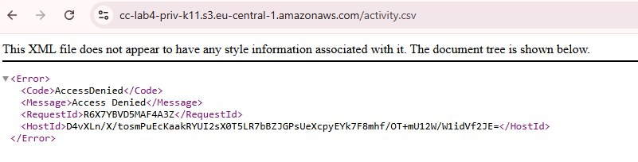
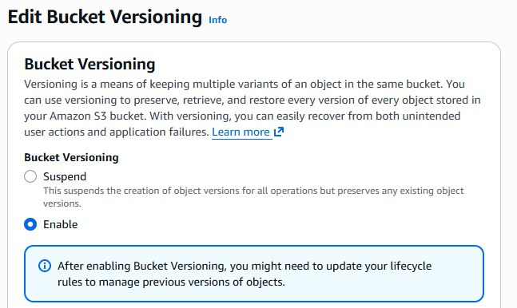
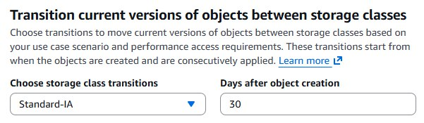
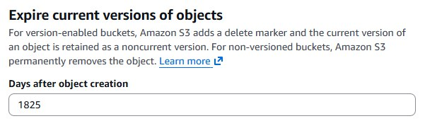
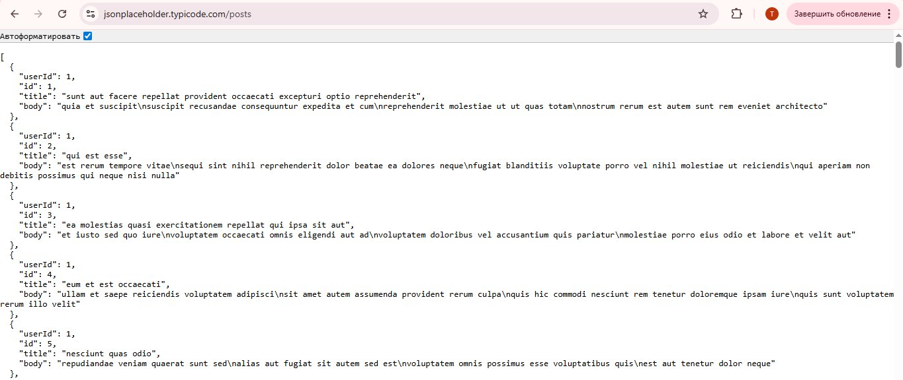

# Лабораторная работа №4. Облачное хранилище данных. Amazon S3

## Цель работы

Целью работы является познакомиться с сервисом Amazon S3 (Simple Storage Service) и отработать основные операции:

- создание публичного и приватного бакетов;
- загрузку и организацию объектов;
- работу с S3 через AWS CLI (копирование, перемещение, синхронизация);
- настройку версионирования и шифрования;
- использование S3 Static Website Hosting;
- применение Lifecycle-правил для архивирования старых данных.

После выполнения работы я:

- понимаю концепцию объектного хранилища и его отличия от блочного и файлового;
- умею создавать и настраивать бакеты в Amazon S3;
- владею навыками загрузки и управления объектами через консоль и CLI;
- знаю, как настроить статический веб-хостинг на базе S3;
- понимаю принципы версионирования и жизненного цикла объектов в S3.

## Условие

_Amazon S3_ — это объектное хранилище AWS, предназначенное для хранения файлов любого типа: изображений, резервных копий, документов, логов и т.д. Каждый объект хранится внутри _бакета_ (bucket) и имеет _уникальный ключ_ (key). "Папки" в консоли — это лишь префиксы ключей, а не настоящие директории.

В этой лабораторной я создала два бакета:

- _Публичный бакет_ - для хранения аватаров пользователей и статического контента;
- _Приватный бакет_ - для логов и служебных файлов (с Lifecycle-политикой).

### Шаг 1. Подготовка

1. Регион: `eu-central-1` (Frankfurt).
2. Формат имён бакетов:
   1. _Публичный_: `cc-lab4-pub-k11`
   2. _Приватный_: `cc-lab4-priv-k11`
3. Локально (на своем компьютере) создаю структуру каталогов и файлов, как показано ниже:

   ```
   s3-lab/
    ├── public/
    │   ├── avatars/
    │   │   ├── user1.jpg
    │   │   └── user2.jpg
    │   └── content/logo.png
    ├── private/
    │   └── logs/
    │       └── activity.csv
    └── README.md
   ```

### Шаг 2. Создание бакетов

Для создания бакетов я использовала следующий вариант:

- использую ACL (упрощённый, наглядный)

> Чем отличаются два способа управления доступом к бакетам в S3?
* ACL (Access Control Lists) - простой и старый механизм, где доступ задаётся прямо для объектов и бакетов (например, сделать файл публичным).
* IAM + Bucket Policy - современный и гибкий способ управления доступом через политики, позволяющий точно контролировать разрешения на уровне всего аккаунта или бакета.

Для реализвации выполняю следующие шаги:

Перехожу в консоль управления AWS S3 и создаю два бакета с указанными именами.

_Публичный бакет_:

1. Имя: `cc-lab4-pub-k11`
2. Region: `eu-central-1`
3. Object Ownership: ACLs enabled (Can be configured using ACLs)
4. _Block all public access_: снять галочку (разрешить публичность)
5. Подтверждаю предупреждение
6. Нажмимаю `Create bucket`

> Что означает опция “Block all public access” и зачем нужна данная настройка?
* “Block all public access” - это настройка, которая полностью запрещает делать бакет или его объекты публичными. Это нужно для того, чтобы защитить данные от случайного или нежелательного публичного доступа и предотвратить утечки.

Аналогично создала _Приватный бакет_ с именем `cc-lab4-priv-k11`, но оставила все настройки по умолчанию (_Block all public access — включен_).

### Шаг 3. Загрузка объектов через AWS Management Console

1. Перехожу в бакет `cc-lab4-pub-k11`.
2. Перехожу в директорию `avatars/` и нажмаю `Upload`.
3. Загружаю файл `user1.jpg` из локальной папки `s3-lab/public/avatars/`.
4. После загрузки в пункте `Permissions` выбираю `Grant public-read access`.
5. Завершаю загрузку нажав `Upload`.

> Чем отличается ключ (object key) от имени файла?
* Имя файла - это название файла на компьютере (например, user1.jpg).
* Object key - полный путь объекта внутри S3, включающий “псевдо-папки”, то есть уникальный идентификатор объекта в бакете.

### Шаг 4. Загрузка объектов через AWS CLI

1. Устанавливаю и настраиваю AWS CLI.
2. Выполняю команду для загрузку файла `user2.jpg` в публичный бакет:

   ```bash
   aws s3 cp s3-lab/public/avatars/user2.jpg s3://cc-lab4-pub-k11/avatars/user2.jpg --acl public-read
   ```

3. Загружаю файл `logo.png` в публичный бакет, в директорию `content/`, также сделав его публичным.
4. Загружаю файл `activity.csv` в приватный бакет, не делая его публичным.

> В чём разница между командами aws s3 `cp`, `mv` и `sync` и для чего используется параметр флаг `--acl public-read`?
* cp - копирует файлы в S3 или из S3.
* mv - перемещает файлы (копирует → удаляет исходный).
* sync - синхронизирует две директории, добавляя недостающие и обновляя изменённые файлы.
* --acl public-read - делает загруженный объект публично доступным для чтения через URL.

### Шаг 5. Проверка доступа к объектам

1. Открываю в браузере URL загруженного публичного объекта:

   ```
   https://cc-lab4-pub-k11.s3.eu-central-1.amazonaws.com/avatars/user1.jpg
   ```


2. Пробую открыть URL загруженного приватного объекта, он должен быть недоступен.



### Шаг 6. Версионирование объектов

Включаю версионирование для обоих бакетов через вкладку `Properties` → `Bucket Versioning` → `Enable`.

1. Изменяю файл `logo.png` и загрузите его заново, чтобы увидеть создание новой версии.
2. Если посмотреть вкладку `Versions`, там будут отображаться все версии объекта.



> Что произойдёт, если выключить версионирование после его включения?
* Существующие версии объектов сохранятся и никуда не исчезнут, новые версии создаваться не будут.

### Шаг 7. Создание Lifecycle-правил для приватного бакета

1. В приватном бакете захожу в `Management` → `Lifecycle rules` → `Create rule`.
   1. Имя: `logs-archive`
   2. Префикс: `logs/`
   3. Actions:
      1. `Transition → Standard-IA` через 30 дней
      2. `Transition → Glacier Deep Archive` через 365 дней
      3. `Expiration → удалить` через 1825 дней (5 лет)
2. Сохраняю правило: `Create rule`.





> Что такое Storage Class в Amazon S3 и зачем они нужны?
* Storage Class - это тип хранилища в S3, определяющий стоимость и уровень доступности данных. Это нужно, чтобы оптимизировать расходы: часто используемые данные хранятся в дорогом, быстрым классе, а редко используемые - в более дешёвых архивных классах.

Старые файлы будут автоматически архивироваться.

### Шаг 8. Создание статического веб-сайта на базе S3

Создайте бакет `cc-lab4-web-k11` для хостинга статического сайта:

1.  Имя: `cc-lab4-web-k11`
2.  Region: `eu-central-1`
3.  Object Ownership: ACLs enabled (Can be configured using ACLs)
4.  _Block all public access_: снять галочку (разрешить публичность)
5.  Нажимаю `Create bucket`

После создания настраиваю хостинг:

1. Перехожу в бакет → вкладка `Properties` → `Static website hosting` → `Edit` -> `Enable`.
2. Выбираю следующие параметры:

   1. _Hosting type_: `Host a static website`.
   2. _Index document_: `index.html`.

3. Проанализировала веб-сайт, прикрепленный к данной лабораторной работе: [веб-сайт](./web/)
4. Скопировала файлы веб-сайта в бакет `cc-lab4-web-k11`. _Не забудьте сделать файлы публичными!_
5. Открыла URL статического сайта, указанный в настройках S3.



С помощью S3 можно быстро и просто развернуть статический сайт без необходимости использования серверов. Например, если у вас есть React-приложение, его собранные файлы можно загрузить в такой бакет для хостинга.

### Вывод

  В ходе лабораторной работы я освоил основные возможности Amazon S3: создание публичных и приватных бакетов, загрузку и управление объектами через консоль и AWS CLI, настройку прав доступа, версионирования и Lifecycle-политик. Я также настроил статический веб-сайт на базе S3 и понял принципы работы объектного хранилища.
Работа позволила закрепить практические навыки использования S3 и понять, как организовывать хранение данных в облаке эффективно и безопасно.

### Использованные источники

