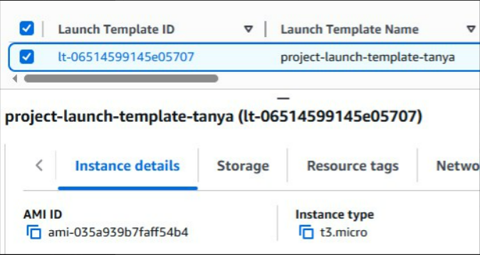
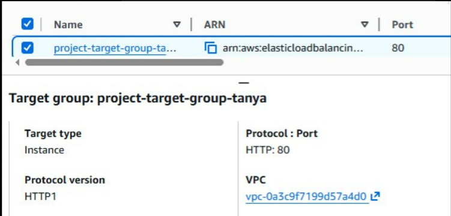
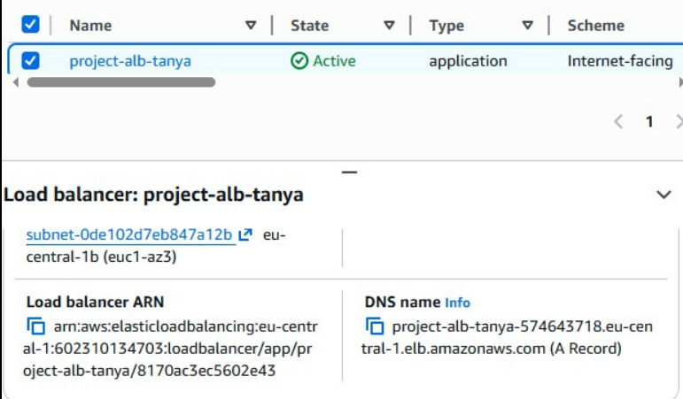
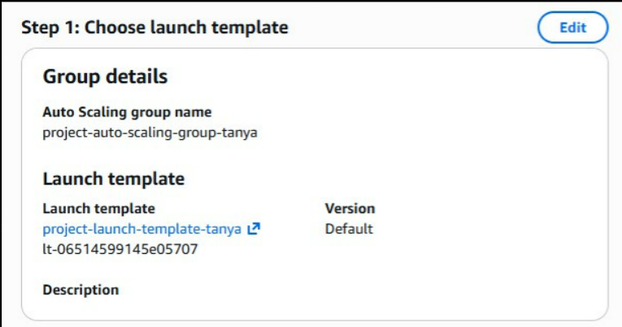
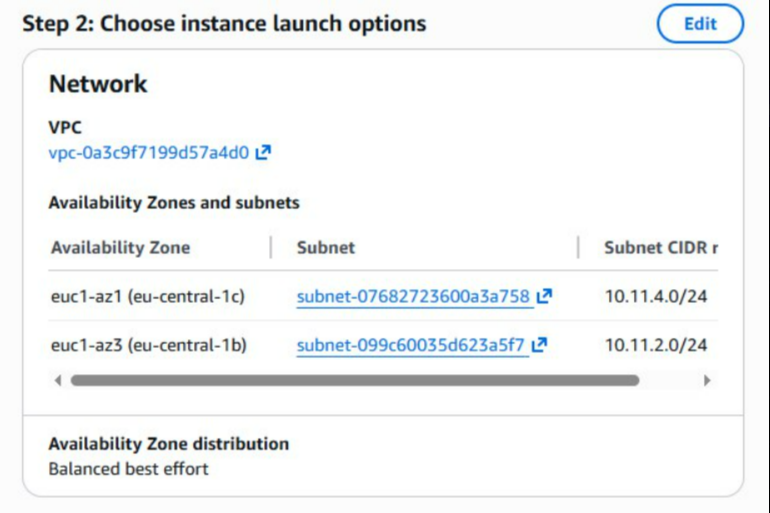
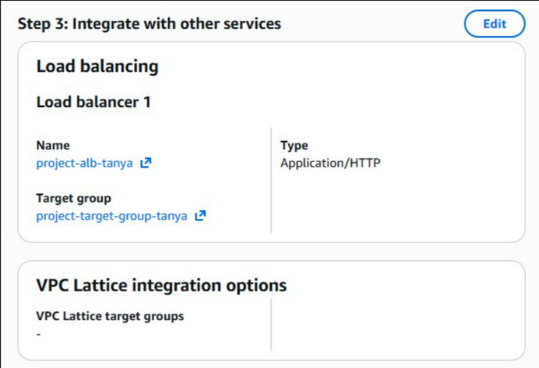
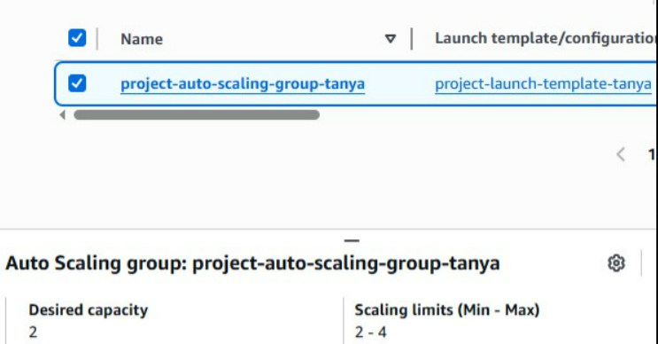

# Лабораторная работа №6. Балансирование нагрузки в облаке и авто-масштабирование

## Цель работы

Закрепить навыки работы с AWS EC2, Elastic Load Balancer, Auto Scaling и CloudWatch, создав отказоустойчивую и автоматически масштабируемую архитектуру.

Я развернула:

- VPC с публичными и приватными подсетями;
- Виртуальную машину с веб-сервером (nginx);
- Application Load Balancer;
- Auto Scaling Group (на основе AMI);
- нагрузочный тест с использованием CloudWatch.

# Практическая часть

### Шаг 1. Создание VPC и подсетей

Я создала новую VPC со следующими параметрами:

- CIDR-блок: **10.0.0.0/16**
- Две публичные подсети:

  - 10.0.1.0/24 (AZ 1а)
  - 10.0.2.0/24 (AZ 1b)

- Две приватные подсети:

  - 10.0.10.0/24
  - 10.0.20.0/24

- Internet Gateway прикреплён к VPC
- Для публичных подсетей настроен маршрут **0.0.0.0/0 → Internet Gateway**

Эти настройки позволяют размещать балансировщик в публичной зоне, а EC2 из Auto Scaling Group - в приватных подсетях.

### Шаг 2. Создание и настройка виртуальной машины

1. **Создаю EC2-инстанс в VPC:**

   - **AMI:** выбираю образ _Amazon Linux 2 (HVM, SSD)_
     Это официальный минимальный Linux-дистрибутив Amazon, идеально подходящий для тестовых веб-серверов.

   - **Тип инстанса:** `t3.micro`
     Бесплатный в Free Tier, производительности достаточно для nginx.

   - **Настройка сети:**

     - VPC: выбираю созданную ранее `project-vpc`
     - Подсеть: выбираю _одну из публичных подсетей_
     - **Auto-assign public IP → Enable**
       Чтобы можно было зайти на сервер и проверить его страницу.

2. **Создаю Security Group для веб-сервера:**

   **Входящие правила:**

   - `SSH` - порт **22**, источник: _My IP_.
     Позволяет подключаться только с моего компьютера.
   - `HTTP` - порт **80**, источник: `0.0.0.0/0`.
     Чтобы сайт был доступен всем пользователям.

   **Исходящие правила:**

   - Разрешаю весь исходящий трафик (`0.0.0.0/0`).
     Это необходимо, чтобы сервер мог скачивать пакеты и обновления.

3. **Включаю мониторинг AWS CloudWatch:**

   Перехожу в
   `Advanced Details → Detailed CloudWatch Monitoring`
   и выбираю **Enable** - это позволит Auto Scaling Group получать более точные метрики нагрузки.

4. **Добавляю запуск nginx через User Data:**

   В разделе **User Data** вставляю скрипт
   Скрипт автоматически:

   - обновит систему,
   - установит nginx,
   - включит его автозапуск,
   - создаст простую стартовую страницу.

5. **Проверяю работу веб-сервера:**

   - Копирую публичный IP-адрес инстанса.
   - Открываю его в браузере.

### Шаг 3. Создание AMI

С запущенного инстанса создала собственный образ **AMI**.
Он будет использоваться Auto Scaling Group для поднятия идентичных экземпляров.

**Разница между image и snapshot:**

- **AMI** - готовый шаблон полного инстанса (диск + настройки).
- **Snapshot** - снимок EBS-диска.
- AMI может включать несколько snapshotов.
- AMI применяется для запуска новых серверов.


### Что такое image и чем он отличается от snapshot? Какие есть варианты использования AMI?

**AMI (Amazon Machine Image)** - это готовый шаблон виртуальной машины, который включает:

- операционную систему,
- настройки,
- установленные программы,
- конфигурацию дисков.

Из AMI можно запускать новые EC2-инстансы.

### Чем AMI отличается от Snapshot?

| AMI                                  | Snapshot                                |
| ------------------------------------ | --------------------------------------- |
| Полный образ всей виртуальной машины | Снимок только EBS-диска                 |
| Можно запускать EC2                  | Нельзя запустить EC2 напрямую           |
| Содержит всю конфигурацию            | Содержит только данные диска            |
| Используется Auto Scaling            | Используется как резервная копия дисков |

### Где используется AMI?

AMI можно использовать для:

1. **Запуска новых EC2-инстансов** (клоны одного и того же сервера).
2. **Auto Scaling Group**, которая создаёт инстансы именно из AMI.
3. **Launch Templates** - AMI является основой шаблона.

### Шаг 4. Создание Launch Template

Создала Launch Template, который хранит параметры будущих EC2:

- выбранная AMI,
- тип инстанса,
- Security Group,
- включён мониторинг CloudWatch.



**Зачем нужен Launch Template?**
Чтобы Auto Scaling Group могла разворачивать одинаковые машины автоматически.

### Что такое Launch Template и зачем он нужен? Чем он отличается от Launch Configuration?

**Launch Template** - это шаблон, который содержит все параметры для запуска EC2-инстанса:

- AMI,
- тип инстанса,
- сеть и подсети,
- ключи доступа,
- Security Group,
- User Data и др.

Он необходим для того, чтобы Auto Scaling Group и другие сервисы AWS могли автоматически запускать одинаково настроенные виртуальные машины.

### Чем Launch Template отличается от Launch Configuration?

| Launch Template                     | Launch Configuration                      |
| ----------------------------------- | ----------------------------------------- |
| Новый и рекомендуемый AWS формат    | Старый и устаревший механизм              |
| Позволяет обновлять версии          | Нельзя изменять — только создавать заново |
| Поддерживает больше настроек        | Ограниченный функционал                   |
| Используется во всех новых сервисах | Постепенно удаляется из AWS               |

### Шаг 5. Создание Target Group

Создала Target Group:

- тип: **Instances**
- протокол: **HTTP**
- порт: **80**
  

### Зачем необходим и какую роль выполняет Target Group?

Target Group - это группа серверов (EC2), на которые Load Balancer отправляет входящий трафик.

Она выполняет три основные задачи:

1. **Направляет трафик от Load Balancer к EC2-инстансам.**
   ALB не работает напрямую с инстансами — он всегда передаёт запросы в Target Group.

2. **Проводит проверку здоровья (health checks).**
   Если инстанс не отвечает, Target Group исключает его из трафика.

3. **Интегрируется с Auto Scaling Group.**
   Все новые EC2, созданные ASG, автоматически добавляются в Target Group.

### Шаг 6. Создание Application Load Balancer

Создала ALB со следующими настройками:

- Scheme: **Internet-facing** (доступен из интернета)
- Публичные подсети в двух AZ
- Security Group с разрешённым HTTP
- Listener 80 → Target Group



Убедилась, что существуют связи между `Listeners`, `Rules` и `Target groups`.

### В чем разница между Internet-facing и Internal?

**Internet-facing Load Balancer**

- Имеет публичный IP-адрес
- Доступен из интернета
- Используется для сайтов, API и любых публичных сервисов

**Internal Load Balancer**

- Не имеет публичного IP
- Доступен только внутри VPC
- Используется для внутренних микросервисов, backend-систем и приватных сетей

### Что такое Default action и какие есть типы Default action?

Default Action - это действие, которое Listener Load Balancer выполняет по умолчанию, если запрос не подходит ни под одно правило маршрутизации.

### Типы Default Action в Application Load Balancer

1. **Forward**
   — отправить трафик в Target Group (самый распространённый вариант).

2. **Redirect**
   — перенаправить клиента, например:
   с `HTTP → HTTPS` или на другой URL.

3. **Fixed response**
   — вернуть фиксированный ответ, например:
   статус `404`, `403` или текстовое сообщение.

### Шаг 7. Создание Auto Scaling Group

Перешла к настройке Auto Scaling, чтобы система могла автоматически увеличивать или уменьшать количество серверов при изменении нагрузки.

В разделе **EC2 -> Auto Scaling Groups** я нажала **Create Auto Scaling group**.

Указала основные параметры:

- **Название:** `project-auto-scaling-group-tanya`
- **Launch template:** выбрала свой шаблон `project-launch-template-tanya`

В разделе **Choose instance launch options** я настроила сеть:

- выбрала свою **VPC**
- указала **две приватные подсети**

В параметре **Availability Zone distribution** я выбрала `Balanced best effort`.
Эта настройка распределяет серверы по разным зонам, чтобы приложение продолжало работать даже при сбоях в одной из зон.

Затем я подключила группу к Load Balancer:

- выбрала **Attach to an existing load balancer**
- указала свою **Target Group (`project-target-group`)**

В **Additional settings** я включила сбор метрик CloudWatch.

После проверки настроек я нажала **Create Auto Scaling group**.






### Почему для Auto Scaling Group выбираются приватные подсети?

Auto Scaling Group размещает свои EC2-инстансы в **приватных подсетях**, потому что:

1. **Безопасность**
   Инстансы не получают публичный IP и недоступны напрямую из интернета - это защищает их от внешних атак.

2. **Правильная архитектура**
   Внешние пользователи должны попадать только через Load Balancer.
   Он принимает трафик и отправляет его на EC2 внутри приватных подсетей.

### Зачем нужна настройка: `Availability Zone distribution`?

Эта настройка определяет, **как Auto Scaling Group будет распределять EC2-инстансы между зонами доступности (AZ)** внутри региона.

Она нужна для:

1. **Отказоустойчивости**
   Если одна зона выйдет из строя, инстансы в другой зоне продолжат работать.

2. **Равномерного распределения нагрузки**
   Auto Scaling создаёт инстансы в разных зонах, чтобы сервис был стабильнее.

### Что такое _Instance warm-up period_ и зачем он нужен?

**Instance warm-up period** - это время, которое даётся новому EC2-инстансу после запуска, чтобы он полностью загрузился и начал работать корректно.

Он нужен для того, чтобы:

- инстанс успел выполнить User Data (например, установить nginx),
- полностью запустил все сервисы,
- начал отдавать корректные метрики CPU,
- Auto Scaling **не учитывал его нагрузку слишком рано**, чтобы не масштабировать систему лишний раз.

### Шаг 8. Тестирование Application Load Balancer

После создания Load Balancer я перешла к проверке его работы:

1. В разделе **EC2 → Load Balancers** я выбрала свой Application Load Balancer и скопировала его DNS-имя.
2. Вставила этот адрес в браузер и убедилась, что открывается страница моего веб-сервера.
3. Затем несколько раз обновила страницу, чтобы посмотреть, как распределяется трафик.

### Какие IP-адреса вы видите и почему?

Это происходит потому, что **Application Load Balancer распределяет входящие запросы между EC2-инстансами**, находящимися в Target Group.
Каждый инстанс имеет свой собственный приватный IP, и ALB перенаправляет запросы на разные машины для балансировки нагрузки.

## **Шаг 9. Тестирование Auto Scaling**

Провела нагрузочный тест:

```
http://<DNS_ALB>/load?seconds=60
```

Открыто 6–7 вкладок одновременно, создавая искусственную загрузку CPU.

CloudWatch зафиксировал рост CPU → Alarm стал "In Alarm".

Auto Scaling Group автоматически создала дополнительные инстансы, увеличив общее количество серверов.
Через панель EC2 видно, что появились новые экземпляры со статусом "Initializing" → затем "Running".

### Какую роль в этом процессе сыграл Auto Scaling?

Auto Scaling автоматически увеличил количество EC2-инстансов, когда нагрузка выросла, чтобы поддержать стабильную работу приложения и не допустить падения производительности.

## **Шаг 10. Очистка ресурсов**

После теста:

- остановлен нагрузочный тест,
- удалён Load Balancer,
- удалена Target Group,
- разобрана Auto Scaling Group,
- завершены EC2-инстансы,
- AMI — deregister + удалён snapshot,
- удалён Launch Template,
- удалена VPC.

Система полностью очищена от ресурсов.

# Использованные источники

# Вывод

В ходе лабораторной работы была реализована полноценная схема балансировки нагрузки и автоматического масштабирования.
Были изучены ключевые компоненты AWS: VPC, EC2, Load Balancer, Target Group, Auto Scaling и CloudWatch.
Результат — создана архитектура, которая автоматически увеличивает количество серверов при росте нагрузки и распределяет входящие запросы между ними.

